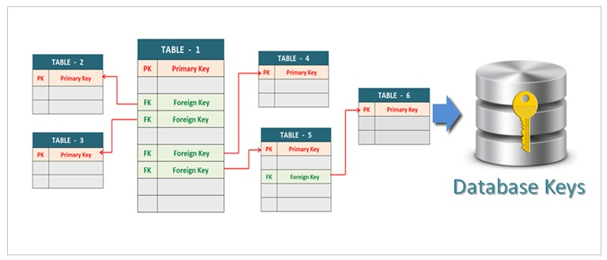

# MSDS 610 Section 2: Database Keys
Professor Michael Ruddy

Group members:
- Zhipeng Hong
- Lawrence Lin
- Nishi Mehta

## A Primer on Relational Databases
Relational Database
: A collection of tables of data, related by a common field
Every table, also known as a relation, as a name for itself and for each of its columns. The data type for each column is also specified e.g. A student's name would be a string. Each relation is a collection of tuples.

## Entity-relationship model
When designing a relational database, one of the steps is the Conceptual Database Design. This is when we develop a high-level description of the data to be stored. This is done through the Entity-Relationship (ER) model, where we describe the objects in the database and their relationsihps. An entity is an object that is described using a set of values. A relationship is an association between two or more entities.

Database keys are used in Relational Database Models to establish/identify relationships between 
relations and uniquely identify tuples within the relations. We cover three types of
keys:

- `PRIMARY KEY`
- `FOREIGN KEY`
- `UNIQUE KEY`

We also illustrate their functionality with relevant code examples.

